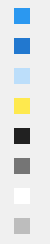
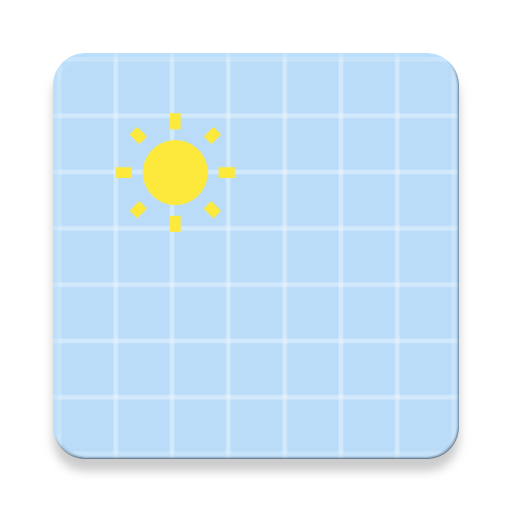
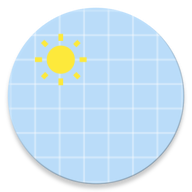
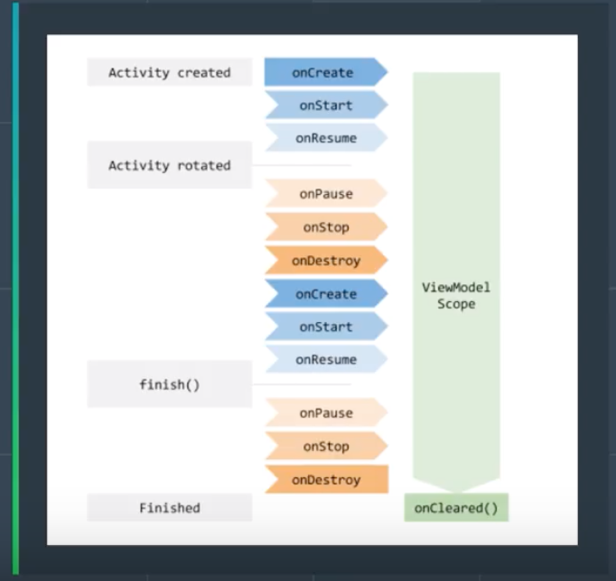
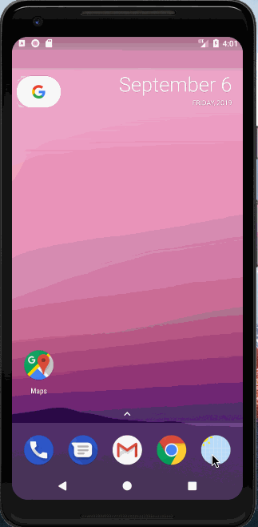
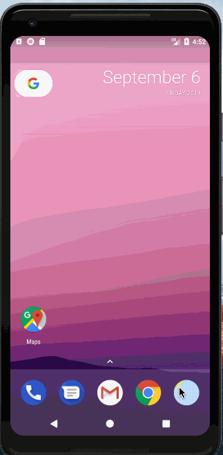

# My Weather App - Android App
### UI - Material Design Palette - [Palette generated by Material Palette](https://materialpalette.com/blue/yellow)

<!-- Palette generated by Material Palette - materialpalette.com/blue/yellow -->

## App Icon Web

## App Icon

## OpenMap API -- (https://www.apixu.com/api.aspx)

## View Model Scope in terms of activity's life cycle

## Design pattern followed

## Weather App

## Swipe Left/ Right to delete cities
